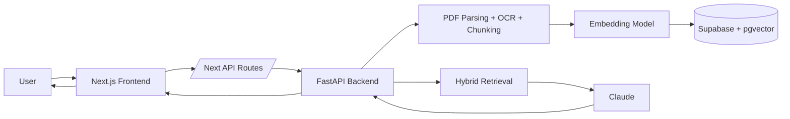
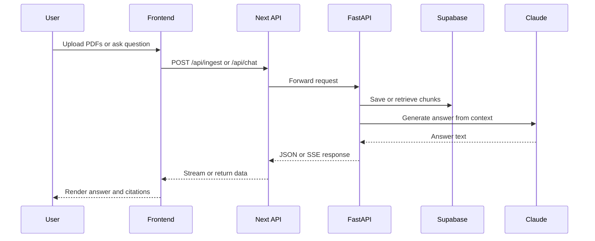
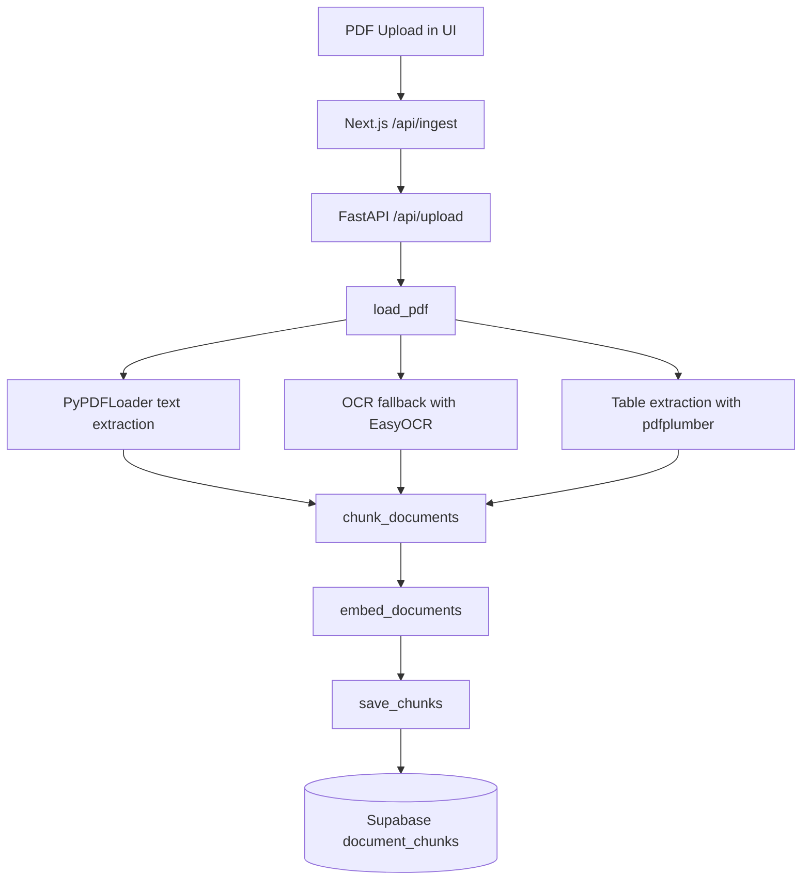
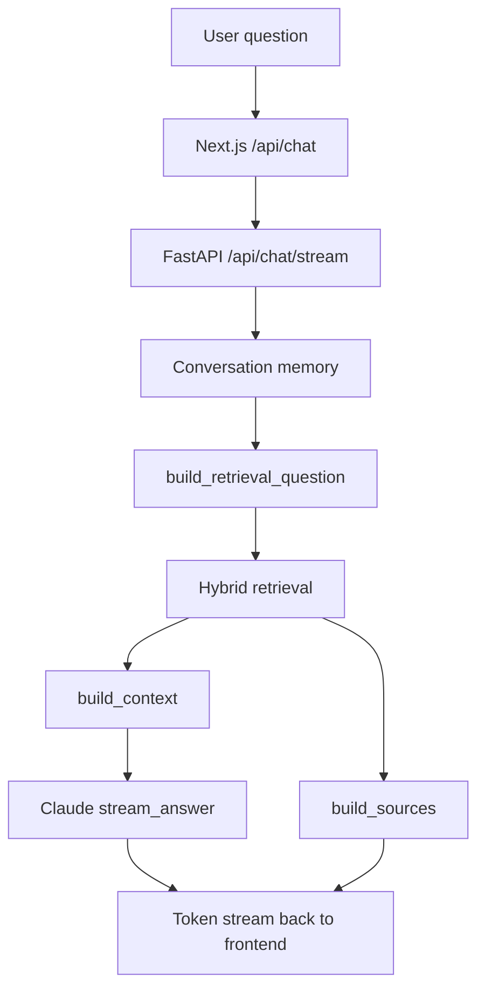
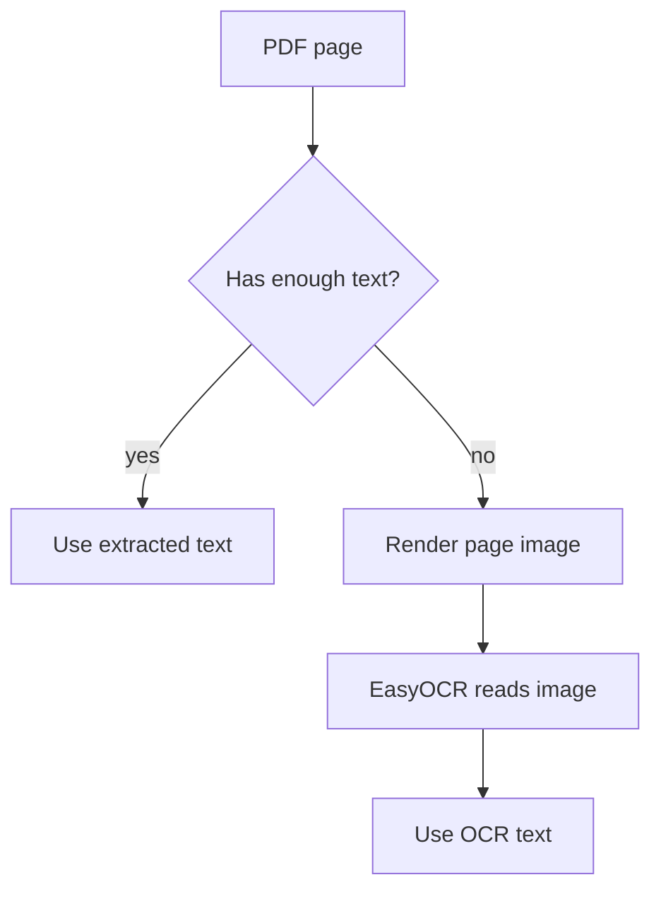
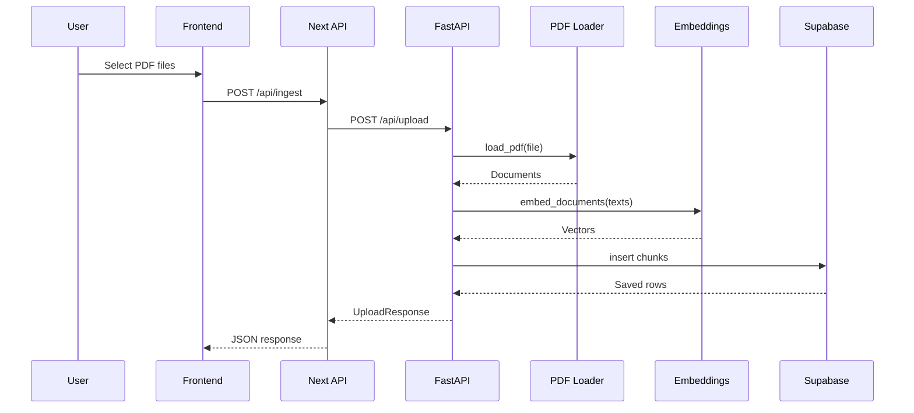
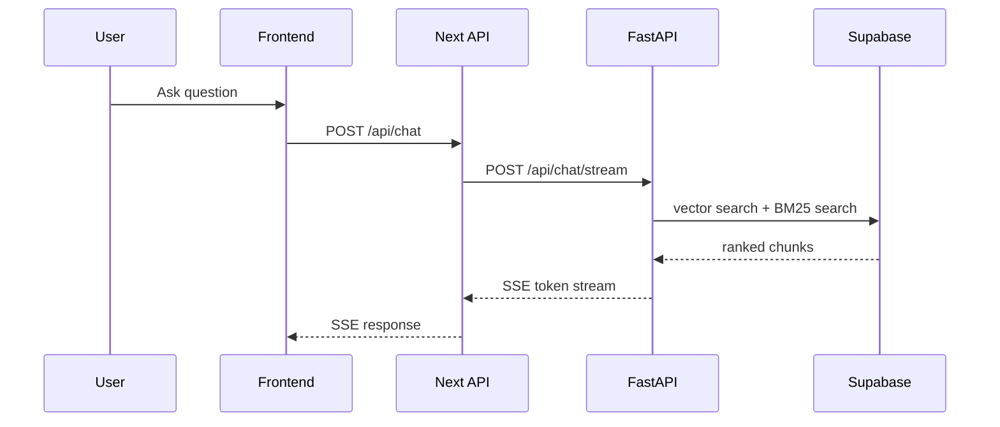
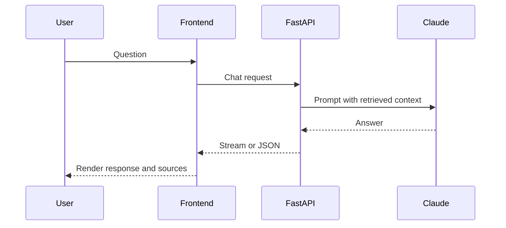
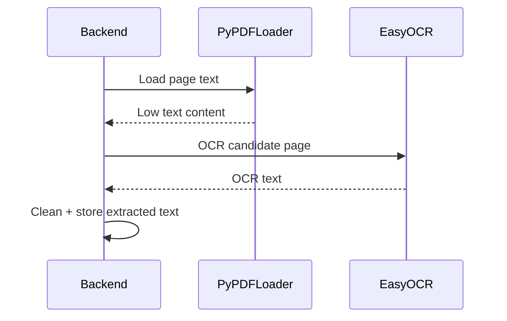
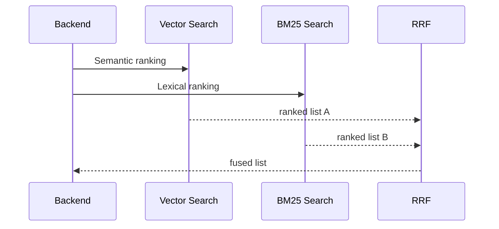

# NeuralDocs AI Project Architecture

This document explains the NeuralDocs AI codebase end to end so a new developer can understand, debug, extend, and rebuild the system from scratch.

It is intentionally detailed and written against the current implementation in this repository, not a hypothetical design.

## Table Of Contents

1. Project Overview
2. System Architecture
3. Data Flow
4. Request Lifecycle
5. Repository Layout
6. Backend File-by-File Guide
7. Frontend File-by-File Guide
8. Complete RAG Pipeline Walkthrough
9. Hybrid Retrieval Deep Dive
10. Claude Integration
11. Database Documentation
12. OCR Pipeline Documentation
13. API Documentation
14. Sequence Diagrams
15. Error Handling Guide
16. Deployment Documentation
17. Extension Guide
18. How NeuralDocs AI Works Internally

---

## 1. Project Overview

NeuralDocs AI is a document question-answering system built around Retrieval-Augmented Generation, usually called RAG.

The user uploads PDF files into a named workspace, the backend extracts and chunks text from the PDFs, generates embeddings, stores chunks in Supabase, and then answers questions by retrieving the most relevant chunks and sending them to Claude.

### What problem it solves

The project solves a common enterprise and research problem:

- Large PDF collections are hard to search manually.
- Standard keyword search misses semantically related text.
- LLMs alone can hallucinate if they are not grounded in source documents.
- Users need answers that are traceable back to pages and filenames.

NeuralDocs AI answers by combining retrieval and generation:

- Retrieval finds relevant document chunks.
- Generation turns those chunks into a readable answer.
- Source citations preserve trust and debuggability.

### Why RAG is used

RAG is used because it allows the system to:

- Answer from private uploaded documents without fine-tuning the model.
- Keep answers grounded in retrieved evidence.
- Update knowledge instantly when users upload new files.
- Avoid placing the entire document corpus into the model context window.

In this project, RAG is the core pattern:

1. User uploads documents.
2. Documents are chunked and embedded.
3. User asks a question.
4. The system retrieves relevant chunks.
5. Claude generates a response using only the retrieved context.

### Why hybrid search is used

Hybrid search combines:

- Vector search for semantic similarity
- BM25 for lexical overlap

This is important because each method has blind spots:

- Vector search is good at meaning, but can miss exact names, codes, IDs, or rare terms.
- BM25 is good at exact terms, but can miss paraphrases and conceptual matches.

Combining them improves recall and ranking quality.

### Why Claude is used

Claude is used as the answer-generation model because it can:

- Follow the system prompt well
- Produce readable, structured answers
- Stay concise while remaining grounded
- Work well with retrieved document context

Claude is not used for raw retrieval. Retrieval happens first, then Claude only sees the selected context.

### Why Supabase is used

Supabase provides:

- PostgreSQL storage
- `pgvector` for embedding storage and similarity search
- A managed backend database
- RPC functions for similarity matching

In this project, Supabase stores the canonical document chunks and metadata.

### Why HuggingFace embeddings are used

The backend uses `langchain_huggingface` with the model:

- `sentence-transformers/all-MiniLM-L6-v2`

This model is used because it is:

- Small and fast
- Well-known for semantic retrieval
- Suitable for short chunk embeddings
- Easy to run locally or in a standard server environment

### End-to-end summary

From upload to answer:

1. User uploads PDFs in the frontend.
2. Frontend forwards the files to the backend upload endpoint.
3. Backend validates file type and size.
4. Backend extracts text, OCR text, and table text from the PDFs.
5. Backend chunks extracted content.
6. Backend generates embeddings.
7. Backend saves chunks and metadata to Supabase.
8. User asks a question.
9. Backend builds a retrieval question using conversation memory.
10. Backend performs hybrid retrieval against Supabase.
11. Backend builds a context block and source list.
12. Claude generates the answer.
13. Frontend streams the answer and renders source citations.

---

## 2. System Architecture

### High-level architecture



### Component responsibilities

- Frontend
  - Collects uploads and questions
  - Streams answers
  - Shows citations and workspace files

- Next.js API routes
  - Proxy browser requests to the backend
  - Hide backend URL details from the client

- FastAPI backend
  - Owns the document pipeline
  - Handles upload, retrieval, and response generation

- Supabase
  - Stores chunks and metadata
  - Executes similarity matching through SQL and RPC

- Claude
  - Turns retrieved context into an answer

### Request flow architecture



---

## 3. Data Flow

### Upload path



### Question answering path



### Workspace file list path

```mermaid
flowchart TD
    A[Workspace selected] --> B[Frontend requests file list]
    B --> C[Next.js /api/workspaces/{workspaceId}/files]
    C --> D[FastAPI /api/workspaces/{workspaceId}/files]
    D --> E[Supabase query on document_chunks]
    E --> F[Grouped filename list]
    F --> B
```

---

## 4. Request Lifecycle

### Upload request lifecycle

1. User selects one or more PDFs.
2. Frontend validates that the file type is PDF.
3. Frontend sends `multipart/form-data` to `/api/ingest`.
4. Next.js API route forwards the form data to FastAPI `/api/upload`.
5. FastAPI validates count, type, and size.
6. Each PDF is extracted into LangChain `Document` objects.
7. Chunking splits the documents into smaller passages.
8. The embedding model generates vectors.
9. Rows are inserted into Supabase.
10. Frontend refreshes workspace file listing.

### Chat request lifecycle

1. User enters a question.
2. Frontend sends the question, workspace ID, selected filenames, and session ID.
3. Next.js API route forwards the JSON to FastAPI.
4. FastAPI loads recent conversation history from in-memory memory.
5. FastAPI rewrites the query for retrieval if the question is a follow-up.
6. FastAPI runs vector search and BM25 search.
7. Results are fused with Reciprocal Rank Fusion.
8. Claude receives the retrieved context only.
9. The answer is streamed back to the browser as SSE.
10. The frontend appends citations and source cards.

---

## 5. Repository Layout

### Top-level

```text
NeuralDocs AI/
├── backend/
├── frontend/
└── PROJECT_ARCHITECTURE.md
```

### Backend layout

```text
backend/
├── app.py
├── requirements.txt
├── .env.example
├── supabase_schema.sql
├── core/
├── database/
├── models/
├── routes/
└── services/
```

### Frontend layout

```text
frontend/
├── app/
├── components/
├── hooks/
├── lib/
├── public/
├── styles/
├── types/
└── __tests__/
```

### Backend responsibilities

- `core/`
  - Settings and prompt templates
- `database/`
  - Supabase client creation
- `models/`
  - Request and response schemas
- `routes/`
  - HTTP endpoints
- `services/`
  - PDF parsing, chunking, embeddings, retrieval, LLM, context assembly, memory, and normalization

### Frontend responsibilities

- `app/`
  - Pages and API proxy routes
- `components/`
  - UI widgets, including chat, file preview, citations, and shadcn primitives
- `hooks/`
  - Shared React hooks like toast and mobile detection
- `lib/`
  - Utility and integration helpers

---

## 6. Backend File-by-File Guide

### `backend/app.py`

#### Purpose

Creates the FastAPI application, enables CORS, registers routers, and exposes health checks.

#### Why it exists

This is the backend entry point Uvicorn imports as `app:app`.

#### Inputs

- Router modules
- HTTP requests from the frontend

#### Outputs

- FastAPI app instance
- `/health` endpoint response

#### Internal workflow

1. Instantiate `FastAPI`.
2. Add permissive CORS middleware.
3. Include the upload router.
4. Include the chat router.
5. Expose `/health`.

#### Dependencies

- `routes.chat`
- `routes.upload`
- `fastapi.middleware.cors`

#### Call chain

- Called by Uvicorn at startup.
- Receives requests from the frontend API proxy.

---

### `backend/core/config.py`

#### Purpose

Defines application settings using `pydantic-settings`.

#### Why it exists

Centralizes environment variables and defaults for embeddings, retrieval, OCR, and file limits.

#### Inputs

- Environment variables from `.env` or runtime environment

#### Outputs

- `Settings` instance via `get_settings()`

#### Important settings

- `supabase_url`
- `supabase_key`
- `anthropic_api_key`
- `supabase_table`
- `embedding_model`
- `chunk_size`
- `chunk_overlap`
- `vector_k`
- `bm25_k`
- `hybrid_k`
- `final_k`
- `max_files`
- `max_file_size_mb`
- OCR and table extraction flags
- `conversation_memory_turns`

#### Dependencies

- `pydantic_settings`

#### Call chain

- Used throughout the backend by almost every service.

---

### `backend/core/prompts.py`

#### Purpose

Defines the system prompt and user prompt template used for Claude generation.

#### Why it exists

The model needs strong instructions to avoid hallucination and to preserve citation behavior.

#### Functions

- `build_user_prompt(question, context, chat_history="")`

#### Workflow

1. Include conversation history if present.
2. Include the user question.
3. Include the retrieved document context.
4. Tell Claude to answer with source citations.

#### Dependencies

- Called by `services.llm_service`

---

### `backend/database/supabase.py`

#### Purpose

Creates a Supabase client.

#### Why it exists

All database access goes through one helper so settings and credentials stay centralized.

#### Function

- `get_supabase_client()`

#### Dependencies

- `supabase.create_client`
- `core.config.get_settings`

---

### `backend/models/requests.py`

#### Purpose

Defines API request schemas.

#### Classes

- `ChatRequest`

#### Fields

- `question`
- `workspace_id`
- `filenames`
- `session_id`

#### Why it exists

Validates and documents incoming chat request bodies.

---

### `backend/models/responses.py`

#### Purpose

Defines API response schemas.

#### Classes

- `UploadResponse`
- `WorkspaceFile`
- `WorkspaceDeleteResponse`
- `Source`
- `ChatResponse`

#### Why it exists

Standardizes the data returned to the frontend and helps FastAPI generate OpenAPI docs.

---

### `backend/routes/upload.py`

#### Purpose

Handles PDF upload and workspace file listing/deletion.

#### Endpoint: `POST /api/upload`

#### Inputs

- `files`: list of uploaded PDF files
- `workspace_id`: form field

#### Outputs

- `UploadResponse`

#### Workflow

1. Validate file count against `max_files`.
2. Load each PDF.
3. Chunk extracted documents.
4. Generate embeddings.
5. Normalize text and metadata.
6. Save rows to Supabase.
7. Return counts.

#### Endpoint: `GET /api/workspaces/{workspace_id}/files`

Returns the distinct files known to the workspace, grouped by filename.

#### Endpoint: `DELETE /api/workspaces/{workspace_id}/files?filename=...`

Deletes all chunks for the named file within the workspace.

#### Dependencies

- `services.pdf_service.load_pdf`
- `services.chunking_service.chunk_documents`
- `services.embedding_service.embed_documents`
- `services.vector_store_service.save_chunks`
- `services.vector_store_service.get_workspace_files`
- `services.vector_store_service.delete_workspace_file`
- `services.text_normalization.clean_text`

---

### `backend/routes/chat.py`

#### Purpose

Handles question answering in both JSON and streaming SSE forms.

#### Endpoints

- `POST /api/chat`
- `POST /api/chat/stream`

#### Workflow

1. Load conversation history.
2. Build a retrieval query.
3. Retrieve chunks with the hybrid retriever.
4. Build answer context and sources.
5. Ask Claude for an answer.
6. Append the turn to conversation memory.

#### Streaming behavior

The streaming endpoint emits:

- `token` events for answer text
- `sources` events for citations
- `done` event when complete
- `error` event if retrieval or generation fails

#### Dependencies

- `services.conversation_memory_service`
- `services.hybrid_retrieval_service`
- `services.context_builder`
- `services.llm_service`

---

### `backend/services/chunking_service.py`

#### Purpose

Splits documents into manageable retrieval chunks.

#### Why it exists

LLMs and vector search work better on smaller, semantically coherent passages than on entire PDFs.

#### Function

- `chunk_documents(documents)`

#### Implementation

Uses `RecursiveCharacterTextSplitter` with project settings.

---

### `backend/services/pdf_service.py`

#### Purpose

Loads PDFs and extracts text, OCR text, and table text.

#### Why it exists

This is the document ingestion engine.

#### Main function

- `load_pdf(file)`

#### Internal workflow

1. Validate the uploaded file is a PDF.
2. Save it to a temporary file.
3. Extract text with `PyPDFLoader`.
4. Normalize metadata.
5. Apply OCR fallback for low-text pages.
6. Extract tables with `pdfplumber`.
7. Clean content to remove unsupported characters like `\x00`.
8. Return a list of LangChain `Document` objects.

#### OCR behavior

The code uses `EasyOCR`, not PaddleOCR. That is the actual implementation in this repository.

#### Helper functions

- `_normalize_metadata`
- `_apply_ocr_fallback`
- `_find_low_text_pages`
- `_get_pdf_page_count`
- `_ocr_pdf_pages`
- `_get_easyocr_reader`
- `_extract_tables`
- `_table_to_markdown`

#### Dependencies

- `PyPDFLoader`
- `PyMuPDF`
- `EasyOCR`
- `pdfplumber`
- `Pillow`
- `numpy`

---

### `backend/services/embedding_service.py`

#### Purpose

Creates embeddings from text.

#### Why it exists

Embeddings turn text into vectors so semantic similarity can be computed.

#### Functions

- `get_embeddings()`
- `embed_text(text)`
- `embed_documents(texts)`

#### Model

- `sentence-transformers/all-MiniLM-L6-v2`

#### Dependencies

- `langchain_huggingface.HuggingFaceEmbeddings`

---

### `backend/services/vector_store_service.py`

#### Purpose

Owns all Supabase interactions for chunks and file lists.

#### Functions

- `save_chunks(chunks)`
- `vector_search(query_embedding, k, workspace_id=None, filenames=None)`
- `get_all_chunks(workspace_id=None, filenames=None)`
- `get_workspace_files(workspace_id=None)`
- `delete_workspace_file(workspace_id, filename)`

#### Workflow

- `save_chunks`
  - Sanitizes row payloads and inserts them into Supabase

- `vector_search`
  - Tries the `match_document_chunks` RPC first
  - Falls back to local cosine similarity if the RPC fails

- `get_all_chunks`
  - Reads chunk rows with selected columns

- `get_workspace_files`
  - Queries all rows for the workspace
  - Groups by filename
  - Tracks chunk count, max page, and content types

- `delete_workspace_file`
  - Checks for matching rows
  - Deletes them by `workspace_id` and `filename`

#### Dependencies

- `database.supabase.get_supabase_client`
- `core.config.get_settings`
- `services.text_normalization`

---

### `backend/services/bm25_service.py`

#### Purpose

Performs lexical ranking over retrieved chunks using BM25.

#### Why it exists

BM25 handles exact term matching better than embeddings.

#### Function

- `bm25_search(question, k, workspace_id=None, filenames=None)`

#### Workflow

1. Load candidate rows with `get_all_chunks`.
2. Tokenize each chunk.
3. Tokenize the question.
4. Compute BM25 scores.
5. Return top-k rows with scores attached.

---

### `backend/services/rrf_service.py`

#### Purpose

Combines multiple ranked result lists with Reciprocal Rank Fusion.

#### Function

- `reciprocal_rank_fusion(ranked_lists, top_k, rrf_k=60)`

#### Workflow

1. Iterate over each ranked list.
2. Assign each item a reciprocal score based on rank.
3. Sum scores across lists for duplicates.
4. Sort by the combined score.

#### Why it exists

It lets vector search and BM25 contribute to a single final ranking.

---

### `backend/services/hybrid_retrieval_service.py`

#### Purpose

Runs the full hybrid retrieval pipeline.

#### Function

- `retrieve(question, workspace_id=None, filenames=None)`

#### Workflow

1. Embed the question.
2. Run vector search.
3. Run BM25 search.
4. Fuse rankings with RRF.
5. Return the final top chunks.

#### Dependencies

- `embedding_service.embed_text`
- `vector_store_service.vector_search`
- `bm25_service.bm25_search`
- `rrf_service.reciprocal_rank_fusion`

---

### `backend/services/context_builder.py`

#### Purpose

Builds prompt-ready context strings and source objects from retrieved chunks.

#### Functions

- `build_context(chunks)`
- `build_sources(chunks)`

#### Why it exists

Claude needs a compact, structured document bundle, and the frontend needs source metadata for citations.

#### Notes

- `build_context` includes workspace, filename, page, content type, extraction method, and content.
- `build_sources` deduplicates by chunk identity and creates snippet previews.

---

### `backend/services/llm_service.py`

#### Purpose

Calls Claude to generate an answer, including streaming support.

#### Functions

- `generate_answer(question, context, chat_history="")`
- `stream_answer(question, context, chat_history="")`

#### Workflow

1. Load Anthropic settings.
2. Try the configured model.
3. Fall back to `claude-haiku-4-5-20251001` if needed.
4. Pass the system prompt and constructed user prompt.
5. Return either one-shot text or streamed tokens.

#### Why it exists

Keeps model access isolated from route logic.

---

### `backend/services/conversation_memory_service.py`

#### Purpose

Keeps short-lived in-memory chat history per session.

#### Functions

- `get_history(session_id)`
- `append_turn(session_id, question, answer)`
- `build_history_context(history)`
- `build_retrieval_question(question, history)`

#### Why it exists

It gives the system short-term conversational memory without requiring a database.

#### Important limitation

This memory is process-local and resets when the backend restarts.

---

### `backend/services/text_normalization.py`

#### Purpose

Cleans text before embedding and persistence.

#### Why it exists

PDF extraction can emit unsupported characters such as null bytes.

#### Functions

- `clean_text(value)`
- `clean_value(value)`

#### Workflow

- Remove `\x00`
- Strip whitespace
- Recursively clean nested structures

---

## 7. Frontend File-by-File Guide

### `frontend/app/page.tsx`

#### Purpose

The main application page for uploads, workspace selection, workspace file listing, and chat interaction.

#### Why it exists

This is the user-facing workspace interface.

#### Main responsibilities

- Track selected files
- Track workspace ID
- Fetch workspace file list
- Upload PDFs
- Ask questions
- Render chat messages and citations

#### Important behaviors

- Uses `/api/ingest` for uploads
- Uses `/api/chat` for answering questions
- Uses `/api/workspaces/{workspaceId}/files` to list and delete workspace files
- Shows inline citation chips with hover previews

#### Dependencies

- `components/chat-message`
- `components/file-preview`
- `components/example-prompts`
- `hooks/use-toast`

---

### `frontend/app/api/ingest/route.ts`

#### Purpose

Forwards browser upload requests to the backend upload endpoint.

#### Why it exists

Keeps backend location hidden from the browser and standardizes upload proxying.

---

### `frontend/app/api/chat/route.ts`

#### Purpose

Forwards chat JSON requests to the backend streaming chat endpoint.

#### Why it exists

Allows the browser to consume SSE while the Next server talks to FastAPI.

---

### `frontend/app/api/workspaces/[workspaceId]/files/route.ts`

#### Purpose

Proxies workspace file list and delete requests to the backend.

#### Endpoints supported

- `GET`
- `DELETE`

#### Why it exists

It lets the browser work with a simple same-origin path while the backend performs the real Supabase operations.

---

### `frontend/components/chat-message.tsx`

#### Purpose

Renders user and assistant messages, copy controls, source list, hover citations, and source detail dialogs.

#### Why it exists

This is where the source trust UX lives.

#### Important features

- Markdown-lite formatting for assistant answers
- Copy to clipboard
- Source chips
- Hover previews for citations
- Expandable source grid
- Full source dialog with highlighted snippet

---

### `frontend/components/file-preview.tsx`

#### Purpose

Shows selected local files before upload and provides remove controls.

---

### `frontend/components/example-prompts.tsx`

#### Purpose

Provides suggested questions for new users.

---

### `frontend/components/ui/*`

#### Purpose

The reusable UI primitive layer, mostly shadcn-style components based on Radix UI.

#### Why it exists

Keeps the visual language consistent and reduces custom UI work.

#### Important example

- `components/ui/hover-card.tsx` is used for citation hover previews.

---

### `frontend/hooks/use-toast.ts`

#### Purpose

Provides the toast notification API used throughout the UI.

---

### `frontend/lib/utils.ts`

#### Purpose

Contains shared utility helpers such as `cn` for class name merging.

---

### `frontend/app/layout.tsx`

#### Purpose

Defines global document layout, metadata, font, and toaster placement.

---

## 8. Complete RAG Pipeline Walkthrough

### PDF upload

1. The user chooses one or more PDF files in the UI.
2. The frontend checks that only PDFs are selected.
3. The browser sends the files to the Next API upload route.
4. The Next API route forwards the form data to FastAPI.
5. FastAPI validates:
   - files exist
   - file count does not exceed the configured limit
   - each file is actually a PDF
   - each file is under the size limit

### Parsing

The ingestion path uses multiple extraction methods:

- `PyPDFLoader` for page text
- `EasyOCR` for scanned or low-text pages
- `pdfplumber` for tables

The project currently uses EasyOCR, not PaddleOCR.

### Chunking

Chunking is needed because:

- Embeddings work better on small text windows.
- Retrieval needs localized passages.
- Context windows are limited.

The project uses `RecursiveCharacterTextSplitter` because it:

- Splits on sensible boundaries when possible
- Preserves nearby context with overlap
- Works well for structured PDFs and prose

#### Why `chunk_size=1000`

This is a practical middle ground:

- Large enough to preserve meaning
- Small enough for precise retrieval
- Small enough to keep downstream context manageable

#### Why `chunk_overlap=200`

Overlap reduces the chance that important information is split across chunks and lost.

### Embeddings

Embeddings are numeric vectors that represent semantic meaning.

In this project:

- Text is converted into 384-dimensional vectors
- Similar ideas have nearby vector representations
- These vectors are stored in Supabase using `pgvector`

#### Why `all-MiniLM-L6-v2`

This model is a strong default for document retrieval because it is:

- Fast
- Lightweight
- Good for semantic similarity
- Easy to host in a standard Python environment

#### Limitations

- Not domain-specialized
- Can miss nuanced technical distinctions
- Does not replace reranking or domain-specific embedding tuning

### Storage

Supabase is used for:

- Durable chunk storage
- Metadata storage
- Vector similarity search

The system stores:

- chunk content
- embedding vector
- workspace ID
- filename
- page number
- content type
- extraction method
- table index

---

## 9. Hybrid Retrieval Deep Dive

### Vector search

Vector search answers questions based on semantic similarity.

Example:

- Query: "How does the system handle scanned PDFs?"
- Retrieved chunk might say: "OCR fallback runs on low-text pages."

The exact words do not need to match.

### BM25

BM25 answers questions based on lexical overlap.

Example:

- Query: "match_document_chunks"
- BM25 is likely to find rows containing that exact function name.

### Why BM25 is needed

Vector search can fail on:

- exact identifiers
- filenames
- function names
- codes and error messages

### Why vector search is needed

BM25 can fail on:

- paraphrases
- synonyms
- conceptual matches

### Hybrid retrieval

This project combines both methods because each corrects the other.

### Reciprocal Rank Fusion

RRF combines ranked lists by rank position instead of raw score magnitude.

The intuition is simple:

- If a chunk ranks well in both systems, it should rise to the top.
- If it only ranks well in one system, it can still survive, but with less weight.

#### Practical example

If a chunk is rank 1 in vector search and rank 5 in BM25, and another is rank 2 in both, RRF can still promote the consistently strong chunk rather than trusting only one scoring system.

---

## 10. Claude Integration

### How Claude is called

Claude is called from `backend/services/llm_service.py` using the Anthropic SDK.

### Prompt construction

The final prompt includes:

- the system prompt
- the current question
- the retrieved document context
- optional conversation history

### Context construction

The context builder formats chunks with:

- workspace
- filename
- page
- content type
- extraction method
- content body

### Source citation generation

Claude is instructed to answer with source citations, and the frontend displays source objects returned by the backend.

### Why Claude is used after retrieval

The system only asks Claude after retrieval because:

- retrieval narrows the input to relevant facts
- it reduces hallucinations
- it saves tokens
- it keeps the answer grounded in uploaded documents

### Token optimization

The project optimizes token usage by:

- chunking documents before retrieval
- retrieving only top-k results
- building compact source snippets
- using conversation history only when useful

---

## 11. Database Documentation

### `document_chunks` table

This is the core table in `backend/supabase_schema.sql`.

#### Columns

- `id`
  - Type: `bigserial`
  - Meaning: unique chunk row identifier

- `content`
  - Type: `text`
  - Meaning: extracted chunk text

- `embedding`
  - Type: `vector(384)`
  - Meaning: semantic vector for retrieval

- `workspace_id`
  - Type: `text`
  - Meaning: workspace namespace

- `filename`
  - Type: `text`
  - Meaning: source PDF name

- `page`
  - Type: `integer`
  - Meaning: source page number

- `content_type`
  - Type: `text`
  - Meaning: `text` or `table`

- `extraction_method`
  - Type: `text`
  - Meaning: `text`, `ocr`, or `table`

- `table_index`
  - Type: `integer`
  - Meaning: table number on page if applicable

- `created_at`
  - Type: `timestamptz`
  - Meaning: insertion timestamp

### `match_document_chunks` function

This RPC function performs vector similarity search.

#### Inputs

- `query_embedding`
- `match_count`
- `workspace_filter`
- `filename_filters`

#### Outputs

- `id`
- `content`
- `workspace_id`
- `filename`
- `page`
- `content_type`
- `extraction_method`
- `table_index`
- `similarity`

#### Filtering logic

- Workspace filter is optional.
- Filename filter is optional.
- Results are ordered by cosine distance.

#### Similarity calculation

The SQL function returns `1 - (embedding <=> query_embedding)` as similarity.

---

## 12. OCR Pipeline Documentation

### OCR detection

The backend looks for pages with very low extracted text and treats them as OCR candidates.

### Scanned PDFs

Scanned PDFs often contain page images rather than embedded text. Standard text loaders produce little or no usable content, so OCR is needed.

### OCR integration

The actual implementation uses `EasyOCR`.

### Fallback logic

1. Load normal page text first.
2. Detect low-text pages.
3. Run OCR on those pages only.
4. Replace or supplement page content with OCR text.

### Diagram



---

## 13. API Documentation

### `POST /api/upload`

#### Request

`multipart/form-data`

- `files`: one or more PDFs
- `workspace_id`: workspace name

#### Response

`UploadResponse`

- `success`
- `documents_processed`
- `chunks_created`

#### Validation

- At least one file is required
- Maximum file count enforced
- Only PDFs accepted
- Size limit enforced

#### Internal flow

- Parse PDFs
- Chunk content
- Embed text
- Store rows in Supabase

#### Error handling

- 400 for invalid input
- 500 for ingestion or database failures

---

### `GET /api/workspaces/{workspace_id}/files`

Returns the files currently indexed in the workspace.

### `DELETE /api/workspaces/{workspace_id}/files?filename=...`

Deletes all indexed chunks for a filename in that workspace.

### `POST /api/chat`

Returns a full non-streaming answer with sources.

### `POST /api/chat/stream`

Streams tokens as SSE and sends sources at the end.

### `GET /health`

Returns backend health status.

---

## 14. Sequence Diagrams

### Upload flow



### Retrieval flow



### Chat flow



### OCR flow



### Hybrid search flow



---

## 15. Error Handling Guide

### Supabase failures

Possible causes:

- invalid credentials
- network failure
- schema mismatch
- RPC function missing

Handling:

- The code falls back from RPC vector search to local cosine similarity.
- Upload failures return HTTP 500 with a clear message.

### Claude failures

Possible causes:

- missing API key
- invalid model name
- provider outage

Handling:

- The service tries a fallback model.
- The route returns a 500 if generation cannot continue.

### OCR failures

Possible causes:

- missing OCR dependencies
- corrupt PDF
- image conversion failure

Handling:

- The PDF service raises a runtime error with a readable message.

### Embedding failures

Possible causes:

- model download failure
- dependency mismatch
- invalid text input

Handling:

- Upload fails before persistence.
- Sanitization removes problematic characters first.

### Upload failures

Possible causes:

- too many files
- non-PDF files
- file too large
- ingestion pipeline exception

Handling:

- The backend returns a clear HTTP 400 or 500 message.
- The frontend shows a destructive toast.

---

## 16. Deployment Documentation

### Frontend

The frontend is designed for Vercel.

Important environment variables:

- `BACKEND_URL`

Build steps:

1. Install dependencies
2. Run Next build
3. Deploy to Vercel

### Backend

The backend is designed for Render or a similar Python host.

Important environment variables:

- `SUPABASE_URL`
- `SUPABASE_SERVICE_ROLE_KEY` or compatible key alias
- `ANTHROPIC_API_KEY`

Build steps:

1. Install Python dependencies
2. Start Uvicorn
3. Confirm `/health`

### Database

Supabase hosts:

- the `document_chunks` table
- the `match_document_chunks` RPC
- the `pgvector` extension

### Deployment flow


---

## 17. Extension Guide

### Reranking

Files affected:

- `backend/services/hybrid_retrieval_service.py`
- `backend/services/rrf_service.py`
- possibly a new `rerank_service.py`

Database changes:

- usually none

API changes:

- none if done internally

Architecture impact:

- improves ranking quality after retrieval

### Multi-document workspaces

Files affected:

- `backend/routes/upload.py`
- `backend/services/vector_store_service.py`
- `frontend/app/page.tsx`

Database changes:

- likely add a workspace metadata table

API changes:

- more workspace management endpoints

Architecture impact:

- enables true file-level workspace management and metadata

### Authentication

Files affected:

- frontend auth flow
- backend middleware
- route authorization checks

Database changes:

- add user tables or organization tables

Architecture impact:

- workspace access must be scoped per user or tenant

### Streaming improvements

Files affected:

- `backend/routes/chat.py`
- `frontend/app/api/chat/route.ts`
- `frontend/components/chat-message.tsx`

Architecture impact:

- better typing and richer intermediate events

### Evaluation dashboard

Files affected:

- new frontend pages
- retrieval logging
- maybe a metrics table

### Additional LLM providers

Files affected:

- `backend/services/llm_service.py`
- config files

Architecture impact:

- abstract provider-specific chat calls behind a common interface

---

## 18. How NeuralDocs AI Works Internally

This section assumes you know Python but are new to RAG, embeddings, vector databases, and hybrid retrieval.

### What LangChain is doing here

LangChain is mostly acting as infrastructure glue:

- it loads PDFs
- it splits text into chunks
- it provides embedding wrappers
- it gives the document object abstraction used throughout ingestion

### What embeddings are

An embedding is a list of numbers that represents the meaning of text.

If two passages mean similar things, their embeddings are close together in vector space.

In simple terms:

- text becomes math
- math becomes similarity
- similarity becomes retrieval

### What a vector database does

A vector database stores embeddings and can find the nearest ones to a query embedding.

Supabase with `pgvector` plays that role in this project.

### What RAG means in practice

RAG means the model does not answer from memory alone.

Instead:

1. Retrieve relevant evidence from documents
2. Feed that evidence into the LLM
3. Ask the LLM to answer using only that evidence

### Why this is better than plain prompting

Without retrieval, the model:

- has no access to your private PDFs
- may hallucinate details
- cannot cite your uploaded pages reliably

### Why hybrid retrieval matters

Suppose the user asks:

- "What is the exact error code in the schema?"

BM25 is good because it matches the code literally.

Suppose the user asks:

- "How are scanned pages handled?"

Vector search is good because it matches meaning even if the exact words differ.

The project uses both because real document questions often need both behaviors.

### How Claude fits in

Claude is the final writer.

It does not search the corpus.
It does not index documents.
It receives a curated context block and turns it into a useful answer.

### Why source citations matter

Source citations help developers and users:

- verify answers
- debug retrieval quality
- inspect the exact page used
- spot missing or weak retrieval

### Mental model for rebuilding the backend

If you were rebuilding this project from scratch, the order should be:

1. Build PDF ingestion
2. Split into chunks
3. Store chunks and metadata
4. Add embeddings
5. Add vector search
6. Add BM25
7. Fuse rankings
8. Build prompt context
9. Call Claude
10. Render citations
11. Add workspace management
12. Add OCR and table extraction

That is the actual backbone of NeuralDocs AI.

---

## Notes And Caveats

- The repository currently uses EasyOCR, not PaddleOCR.
- The conversation memory is in-process and is not durable across restarts.
- The system stores indexed chunks in Supabase, not the original uploaded PDFs.
- Workspace file deletion removes indexed rows for that filename within that workspace.

If you want, the next useful step is to add a compact `ARCHITECTURE_OVERVIEW.md` summary version for quick onboarding, while keeping this file as the deep technical reference.
